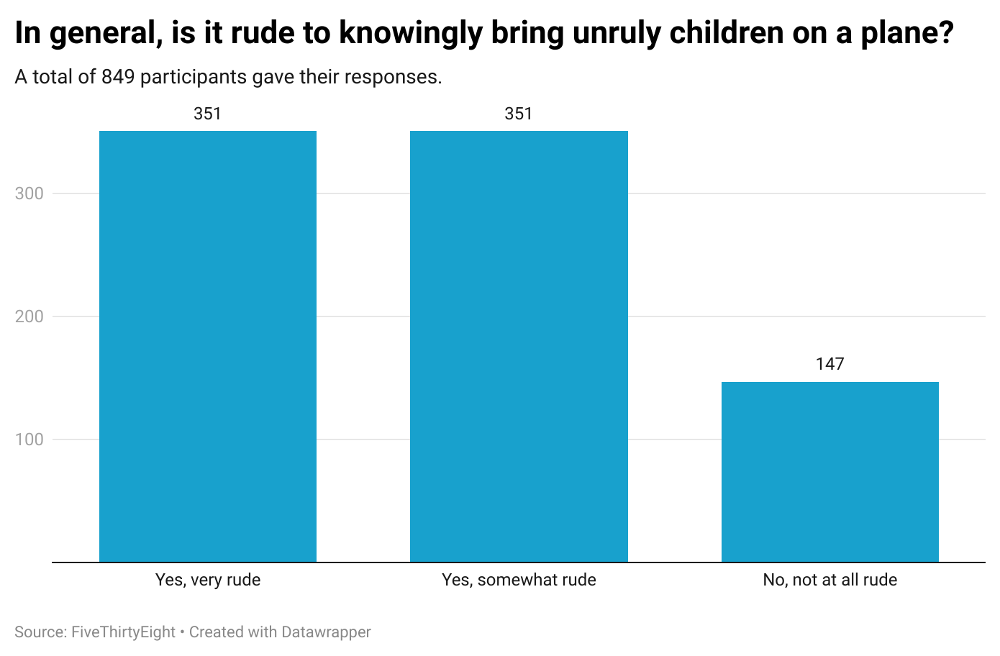

# journ124-hw4
## Question
In general, is it rude to knowingly bring unruly children on a plane?

## Why this question?
I chose this question after a recent flight experience that made me question my seating arrangement. I also found it interesting that an overwhelming majority of the surveyors found it rude to knowingly bring unruly children on a plane.

## Chart

### What does my chart show?
My chart reveals that over 80% of the 849 survey participants found it at least somewhat rude to knowingly bring unruly children on a plane. It also shows that there was an equal number of participants who voted “Yes, very rude” and “Yes, somewhat rude”. Finally, my chart shows that 147 of the participants voted that it is not rude at all to knowingly bring unruly children on a plane.
